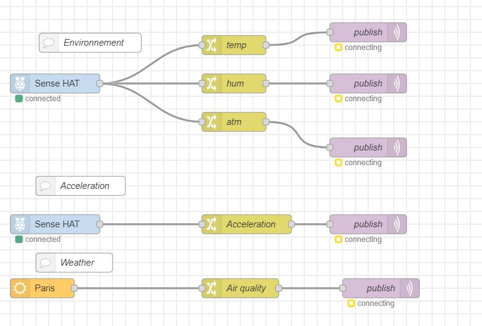

# Readme

Ce projet consiste à établir une communication entre deux Raspberry Pi via le protocole MQTT.

On a essayé d'afficher les données collectées par SenseHat1 dans le Dashboard de la Raspberry Pi 2 .

Pour notre cas  , on a utilisé NodeRed pour réaliser ce projet.


## Installation
On  installe MQTT

```bash
sudo apt-get install mosquitto
sudo apt-get install mosquitto-clients
```
Pour assurer la communication , faut suivre ces instructions supplémentaires : 

- Aller sur /etc/mosquitto/conf.d/
- créer un fichier connect.conf
- listener 1883
  allow_anonymous true


Pour vérifier si ça marche ou pas , suivez les instructions [ici](https://projetsdiy.fr/mosquitto-broker-mqtt-raspberry-pi/)


## Node Red


Pour transmettre les informations on utilise le schéma suivant :





Le node *publish* est configuré avec l'ip du récepteur ( Brokker ) , et avec un Topic bien précis :


Pour la réception des données : 


Les nodes *Subscribe_* sont configurés , en précisant le *Topic* pour bien récevoir les données :


Les résultats sont affichées dans un Dashboard.


## Difficultées rencontrées


- [ ] Problème des nodes de SenseHat dans le NodeRed : [solution](https://discourse.nodered.org/t/unable-to-find-sense-hat-library/54275/12)

- [ ] Problème d'affichage des données d'environement et de motion , en même temps : [solution](https://discourse.nodered.org/t/cant-read-motion-data-from-sense-hat-in-node-red/55323)

   
